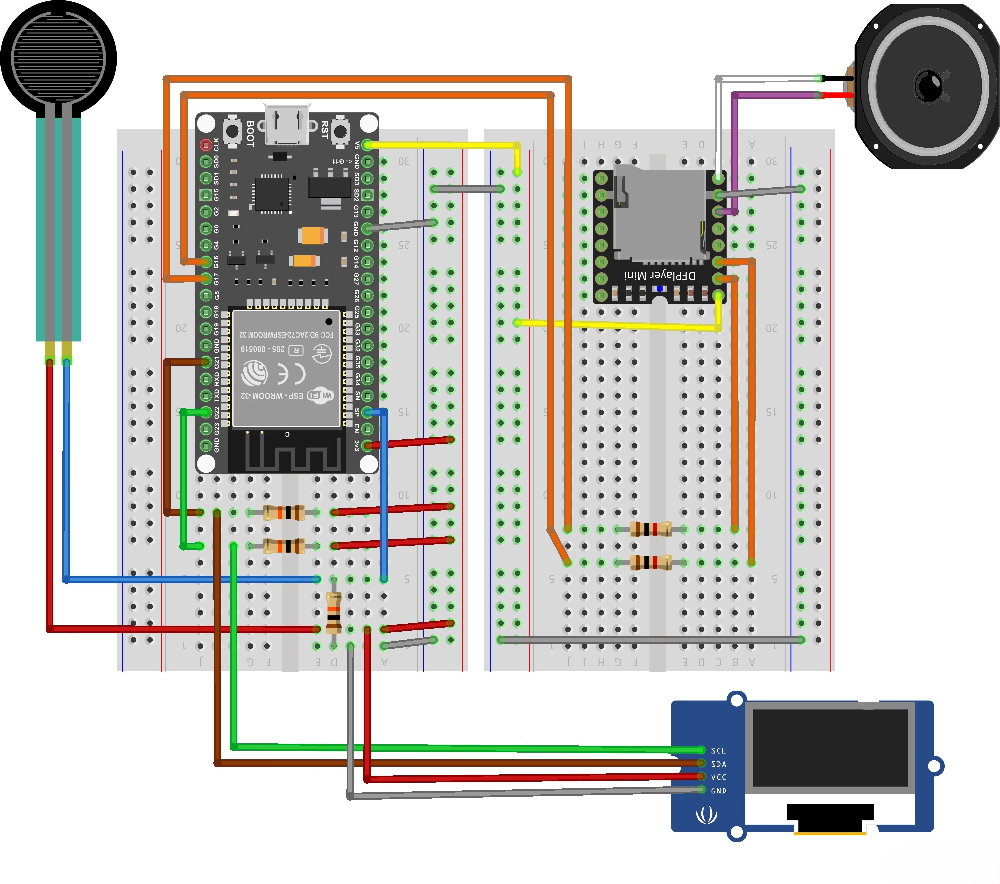
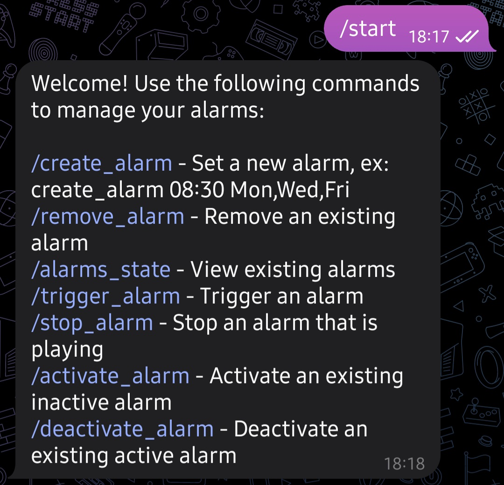

# Smart_IoT_Alarm
Development of an IoT-powered Smart Alarm, based on an ESP32 board.

The project has been created for the course of Internet of Things at UNIBO.

**Objective**: Design and IoT-based alarm system that incorporates bed presence detection to ensure the alarm is only triggered when the user is in bed and automatically set off when the user gets up.

**Components**:

- Espressif ESP32-WROOM-32 board to sample the data, manage the screen and send/receive commands and data throught Wi-Fi, using MQTT and HTTP communication protocols.
- KeeYees Mini MP3 DFPlayer Player Module, connected to the main board through UART interface, responsible for piloting the 2W speaker.
- AZDelivery 0.91" OLED Display, equipped with SSD1306 Chip, connected to the ESP32 with an I2C interface.
- Fafeicy thin film pressure sensor, connected as an analog device (sensitivity between 20g to 10kg).

**Schematics**:

**Features**:

- The board will acquire and transmit the sensor data to a data proxy via HTTP protocol, with a specified sampling rate; in addition, the alarm will support the MQTT protocol to receive configuration updates from the server, allowing to set the sampling rate, to both trigger or stop an alarm and to set a new alarm.
- A php script executed on an online server will append the new data into a time-series dataset (.CSV file), which will be used to make considerations over the past data (hours of sleep), and at the same time the script sends a data point to an InfluxDB dataset instance, behaving as the data proxy.
- To set the alarms there will be two viable ways: using the server's terminal, it will be possible to set the alarms time via MQTT; a Telegram Bot allows to check, control, remove, create, activate or stop different alarms, with a simple command explanation.

The Telegram bot provides a simple command list when /start is sent as a new message:

The server that receives and manages the sensor data (data proxy) has both a Mosquitto instance running, needed to send MQTT configuration data to the IoT node, and an Apache2 instance able to manage the HTTP data coming in, both appending the sensor data to a .CSV file and sending it to InfluxDB through a php script.
The PHP script (index.php) runs on the server each time the ESP board sends a new piece of data to save.

- The alarm sound is dynamically changed according to the weather forecasted for the day, in order to set the right mood: the OpenWeather library allows to fetch the data related to a specific place, data which is used to select a specific pre-uploaded track, based on the weather conditions. The weather data is retrieved through an HTTP request, thanks to the Open Weather API.
- Calling a python script (HowMuchSleep.py) from the server it is possible to get an approximate estimate of the hours of sleep in the previous period of time, which can be parsed as a script argument (defining an integer number of days to consider starting from yesterday).

Useful commands from server's terminal:
- Check Apache2 status: sudo systemctl status apache2
- Check Mosquitto status: sudo systemctl status mosquitto
- Compute the amount of sleep hours: python3 HowMuchSleep.py 7 # To consider the previous week (int n. of days)
- MQTT commands to the broker:

  SAMPLING_RATE: mosquitto_pub -h IP_ADDRESS -p PORT -t Topic/SAMPLING_RATE -u USERNAME -P 'password' -m '30000' // in msec
  
  TRIGGER_ALARM: mosquitto_pub -h IP_ADDRESS -p PORT -t Topic/TRIGGER_ALARM -u USERNAME -P 'password' -m '1' 
  
  STOP_ALARM: mosquitto_pub -h IP_ADDRESS -p PORT -t Topic/STOP_ALARM -u USERNAME -P 'password' -m '1' 

  NEW_ALARM: mosquitto_pub -h IP_ADDRESS -p PORT -t Topic/NEW_ALARM -u USERNAME -P 'password' -m '12:30' // HH:MM format

**Additional implementation**:
- Grafana dashboard to display the actual values available in the database (Influxdb) and the average sleeping time.
